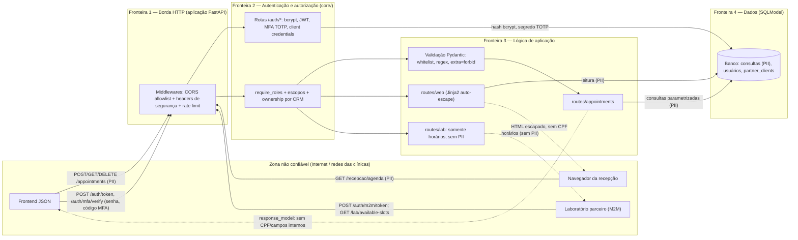

# MedSync API — Modelagem de Segurança, Ameaças e Arquitetura (Ex. 3, 4 e 5)

> **Legenda de status** (todo controle citado é classificado): **Implementado** (existe no código e tem teste/evidência) · **Parcial** · **Não implementado** (risco residual ou recomendação).

---

## 1. Exercício 3 — Fundamentos de segurança e modelagem inicial

### 1.1 Tríade CIA no domínio de saúde (LGPD)

Dados de saúde são **dado pessoal sensível** (LGPD, art. 5º, II). A confidencialidade tem peso regulatório adicional: o vínculo *paciente × especialidade* já é, por si, um dado de saúde.

| Pilar | Impacto | Controles | Status |
| :-- | :-- | :-- | :-: |
| **Confidencialidade** (peso crítico) | Vazamento de quem consulta qual especialidade (ex.: psiquiatria, oncologia) gera estigma e sanção da ANPD. | `response_model` sem CPF nem campos internos; template só com campos de triagem; autenticação em todas as rotas de dados; ownership por CRM; M2M restrito a escopo de horários; `Cache-Control: no-store`; CORS com allowlist | Implementado |
| | Dados em repouso | CPF e `mfa_secret` ficam **em texto** no banco | **Não implementado** (residual R1) |
| **Integridade** (peso alto) | Adulterar horário/médico da consulta pode causar erro de atendimento. | Pydantic com tipos, regex e whitelist; `extra='forbid'`; só médico do CRM cria/apaga; JWT assinado com `exp`; SQL parametrizado | Implementado |
| | Rastreabilidade de quem alterou | Há `created_by_ip`/`internal_audit_id`/`created_at` na criação. **Não há** log de acesso/alteração por usuário (`/admin/audit-logs` devolve dados de demonstração) | **Parcial** |
| **Disponibilidade** (peso alto) | Indisponibilidade impede atendimentos. | Rate limit de login e MFA; página da agenda com `limit ≤ 200`; sessão de banco fechada pelo `Depends(get_session)` | Parcial |
| | Escala/DoS distribuído | Rate limiter em memória por IP: não funciona em múltiplas instâncias nem atrás de proxy | **Não implementado** (residual R3) |

### 1.2 Frameworks de referência × controles implementados

| Framework | Item | Controle MedSync | Onde |
| :-- | :-- | :-- | :-- |
| **OWASP API Top 10 2023** | API1 BOLA | `enforce_appointment_ownership` | `core/dependencies.py` |
| | API2 Broken Authentication | bcrypt, JWT com `exp`, MFA TOTP, rate limit | `core/security.py`, `routes/auth.py` |
| | API3 BOPLA / Mass Assignment | `response_model`, `extra='forbid'` | `models/*.py` |
| | API4 Unrestricted Resource Consumption | Rate limit, `limit ≤ 200` | `core/middleware.py`, `routes/web.py` |
| | API5 BFLA | `require_roles`, `require_admin_with_mfa`, escopos | `core/dependencies.py` |
| | API8 Security Misconfiguration | Headers, CORS allowlist, docs off em produção | `main.py`, `core/middleware.py` |
| **OWASP Top 10 2021** | A03 Injection (XSS/SQLi) | Whitelist + auto-escape + CSP; SQLModel parametrizado | `models/`, `templates/`, `database/` |
| | A02 Cryptographic Failures | Segredos fora do código (`BaseSettings`) — porém dados em repouso sem cifra (R1) | `core/config.py` |
| **NIST SSDF (SP 800-218)** | PW.1 Projetar para requisitos de segurança | Threat model (Ex. 4–5) antes de implementar os controles | este documento |
| | PW.5 / PW.6 Práticas seguras de codificação e build | Pydantic estrito, ORM parametrizado, ambiente virtual com dependências auditadas por pip-audit | `models/`, `requirements.txt` |
| | PW.7 Revisar/analisar o código | Bandit (SAST) | `.github/workflows/security-pipeline.yml` |
| | PW.8 Testar o código executável | pytest (63 testes), OWASP ZAP (DAST) | `tests/`, `scripts/run_zap_scan.sh` |
| | RV.1 Identificar vulnerabilidades continuamente | pip-audit a cada PR + cron semanal | workflow |
| **MITRE ATT&CK** | T1190 Exploit Public-Facing Application | Mitigado por validação de entrada, auth em todas as rotas e headers | `models/`, `core/` |
| | T1110.001 Brute Force: Password Guessing | Rate limit + bcrypt | `routes/auth.py` |
| | T1078 Valid Accounts (token roubado) | `exp` curto e MFA para admin (sem revogação: R2) | `core/security.py` |
| | T1552.001 Credentials in Files | Sem segredos no código; `.env` ignorado; `.env.example` sem valores | `core/config.py`, `.gitignore` |
| | T1059.007 JavaScript (XSS) | Auto-escape + whitelist + CSP | `templates/`, `models/` |

### 1.3 DFD básico com trust boundaries e fluxos de dados sensíveis

Fluxos que carregam **dados de paciente** estão marcados com **(PII)**.

**Leitura das fronteiras:**
- **F0→F1:** tudo que chega é não confiável. Contramedidas: CORS com allowlist, HSTS, rate limit.
- **F1→F2:** nenhuma rota de dados é alcançada sem token válido (única exceção: login, emissão M2M e healthcheck).
- **F2→F3:** a decisão “quem pode o quê” é tomada em um só lugar antes da lógica de negócio.
- **F3→F4:** única via para o banco é o ORM com parâmetros; **CPF cruza F4→F3 mas nunca volta a F0**.
- **Pontos fracos do desenho:** o banco guarda CPF e `mfa_secret` sem cifra (R1); e todas as fronteiras vivem em um único processo (compromisso do processo = compromisso de todas).

---

## 2. Exercício 4 — Modelagem de ameaças (misuse cases + STRIDE)

### 2.1 Ativos
| Ativo | Valor | Onde fica |
| :-- | :-- | :-- |
| Vínculo paciente × especialidade e CPF | Dado de saúde sensível (LGPD) | tabela `appointments` |
| Credenciais (hash bcrypt, segredo TOTP) | Controle de acesso | tabela `users` |
| `SECRET_KEY` do JWT | Forja de qualquer identidade | variável de ambiente |
| Segredo do cliente M2M | Acesso do laboratório | tabela `partner_clients` (hash) |
| Integridade da agenda | Continuidade do atendimento | tabela `appointments` |

### 2.2 Superfícies de ataque
`POST/GET/DELETE /appointments`, `GET /recepcao/agenda`, `POST /auth/token`, `/auth/mfa/verify`, `/auth/register`, `/auth/m2m/token`, `GET /lab/available-slots`, `/admin/audit-logs`, `/docs` e `/openapi.json`, cabeçalhos/CORS, repositório de código e variáveis de ambiente.

### 2.3 Misuse cases
| ID | Misuse case | Ator | Ação | Impacto | Mitigação (status) | Teste |
| :-: | :-- | :-- | :-- | :-- | :-- | :-- |
| MC-01 | XSS stored via nome do paciente | Conta de profissional comprometida/maliciosa | `patient_name=<script>…` | Sequestro de sessão de quem abre a agenda | Whitelist + auto-escape + CSP (Implementado) | `test_whitelist_and_regex_validation`, `test_jinja2_template_autoescape_prevents_stored_xss` |
| MC-02 | Vazamento de metadados internos | Qualquer cliente autenticado | Ler JSON procurando IP/IDs de auditoria | Mapear rede interna | `response_model` (Implementado) | `test_response_model_blocks_internal_audit_fields` |
| MC-03 | BOLA/IDOR | Médico ou recepcionista mal-intencionado | Trocar o ID na URL | Violação massiva de dados de saúde | Ownership centralizado (Implementado) | `test_doctor_ownership_enforcement` |
| MC-04 | Mass assignment | Cliente da API | Enviar `status`/`internal_audit_id` | Burlar fluxo e auditoria | `extra='forbid'` (Implementado) | `test_extra_forbid_blocks_parameter_pollution` |
| MC-05 | Escalada via cadastro | Anônimo | `POST /auth/register` com `role=admin` | Controle total | Rota só para admin+MFA; `partner` vetado (Implementado) | `test_register_*` |
| MC-06 | Bypass de MFA | Atacante com senha de admin | Código fixo ou força bruta de 6 dígitos | Acesso administrativo | TOTP + 1º fator obrigatório + rate limit (Implementado) | `test_mfa_*` |
| MC-07 | Abuso do token do laboratório | Parceiro ou atacante com o token | Usar token M2M em rotas de pacientes | Quebra do contrato e vazamento | Papel humano exigido + escopo mínimo (Implementado) | `test_partner_token_*` |
| MC-08 | Força bruta no login | Bot | Milhares de tentativas | Credencial médica comprometida | Rate limit + bcrypt (Parcial: em memória, R3) | `test_login_rate_limiting` |

### 2.4 STRIDE aplicado a quatro componentes
O enunciado pede ao menos três; foi acrescentado o componente de autenticação por ser o de maior impacto histórico.

**Componente 1 — API REST de consultas (`routes/appointments.py`)**
| STRIDE | Ameaça | Mitigação | Status |
| :-: | :-- | :-- | :-: |
| S | Forjar identidade/CRM de outro médico | JWT assinado com `exp`/`sub` obrigatórios, algoritmo fixo; CRM do corpo comparado ao do token | Implementado |
| T | Adulterar payload / campos extras | Pydantic estrito + `extra='forbid'` | Implementado |
| R | Negar ter apagado uma consulta | `created_by_ip`/`internal_audit_id` na criação; **sem log de exclusão** e exclusão física | **Parcial** |
| I | Expor CPF/campos internos ou dados de terceiros | `response_model`, ownership, `no-store` | Implementado |
| D | Inundação de criação de consultas | Rate limit **apenas** em login/MFA; **não** em `POST /appointments` | **Não implementado** |
| E | Recepção/laboratório executando ações de médico | `require_roles` + escopos | Implementado |

**Componente 2 — Portal da recepção (`routes/web.py` + Jinja2)**
| STRIDE | Ameaça | Mitigação | Status |
| :-: | :-- | :-- | :-: |
| S | Acessar a agenda sem ser recepcionista | Token + papel + escopo (sem cookie de sessão: nada a roubar) | Implementado |
| T | XSS stored | Whitelist + auto-escape + CSP | Implementado |
| R | Não saber quem viu a agenda | Sem log de acesso | **Não implementado** |
| I | Exibir CPF/metadados | Template só com campos de triagem; `no-store` | Implementado |
| D | Página com milhares de linhas | Filtro `?data=` e `limit ≤ 200` | Implementado |
| E | Script no navegador do operador | CSP sem `script-src` | Implementado |

**Componente 3 — Persistência (`database/`)**
| STRIDE | Ameaça | Mitigação | Status |
| :-: | :-- | :-- | :-: |
| S | Conexão ilegítima ao banco | `DATABASE_URL` por `BaseSettings`; **SQLite local sem credenciais** no ambiente de desenvolvimento | Parcial |
| T | SQL injection | SQLModel parametrizado | Implementado |
| R | Apagar histórico clínico | Exclusão física, sem soft delete | **Não implementado** |
| I | Vazamento de credenciais no repositório; dump do banco | `.env` ignorado; sem segredos no código; **CPF e `mfa_secret` sem cifra** | Parcial (R1) |
| D | Esgotamento de conexões | Sessão por requisição, fechada ao final | Implementado |
| E | Usuário do banco com excesso de permissão | Depende do SGBD de produção (menor privilégio) | **Não implementado** (recomendação) |

**Componente 4 — Autenticação (`routes/auth.py`, `core/security.py`)**
| STRIDE | Ameaça | Mitigação | Status |
| :-: | :-- | :-- | :-: |
| S | Token forjado, `alg=none`, MFA fixo | Assinatura verificada, `exp` obrigatório, TOTP com 1º fator | Implementado |
| T | Alterar claims (papel/CRM) | Assinatura HS256 com chave ≥ 32 caracteres | Implementado |
| R | Negar uma operação de admin | `authorized_admin` aparece na resposta, mas **não há log persistente** | **Não implementado** |
| I | Enumerar usuários | Mesma resposta e custo de tempo (`DUMMY_PASSWORD_HASH`) | Implementado |
| D | Força bruta de senha/MFA | Rate limit por IP (e IP+usuário no MFA) | Parcial (R3) |
| E | Auto-cadastro como admin | `/auth/register` só admin+MFA | Implementado |

### 2.5 Mapeamento ameaça → mitigação → verificação
Consolidado na matriz de rastreabilidade de `docs/relatorio_final_capstone_ex12_ex13.md` (§1.4 e §2.1).

---

## 3. Exercício 5 — Arquitetura de segurança e vetores de ataque

### 3.1 Partições do sistema e fluxo de dados

| # | Partição | Módulos | Entrada | Saída |
| :-: | :-- | :-- | :-- | :-- |
| 1 | **Borda** | `app/main.py`, `core/middleware.py` | HTTP bruto | Requisição com headers/CORS/limite aplicados |
| 2 | **Identidade e acesso** | `routes/auth.py`, `core/security.py`, `core/dependencies.py` | Credenciais/token | Identidade (`TokenPayload`) autorizada ou 401/403 |
| 3 | **Aplicação e validação** | `routes/*.py`, `models/*.py`, `templates/` | Requisição autorizada | Objeto validado; resposta filtrada ou HTML escapado |
| 4 | **Persistência** | `database/session.py`, `database/users.py` | Operações parametrizadas | Registros |
| 5 | **Configuração e CI** | `core/config.py`, `.env`, workflow, Docker | Variáveis de ambiente | Segredos, gate de segurança |

Fluxo principal: `Cliente → 1 Borda → 2 Identidade/Autorização → 3 Validação/Rota → 4 Banco → 3 response_model/Jinja2 → Cliente`. O CPF viaja 4→3 e **é descartado em 3**.

### 3.2 Vetores nos três eixos de segurança de APIs

**Eixo 1 — Design**
| ID | Vetor | Risco | Mitigação | Status |
| :-: | :-- | :-- | :-- | :-: |
| D-01 | BOLA (ID previsível, sem vínculo médico-consulta) | Ler/apagar dados alheios | Ownership centralizado | Implementado |
| D-02 | Excesso de privilégio na integração M2M | Laboratório vendo pacientes | Escopo `appointments:read_slots` + papel `partner` negado nas rotas humanas | Implementado |
| D-03 | Reuso do modelo de tabela como modelo de API | Mass assignment e vazamento | Modelos `Create`, `Appointment` (tabela) e `Response` separados | Implementado |
| D-04 | IDs sequenciais e 404≠403 | Enumeração | UUID + 404 uniforme | **Não implementado** (R4) |

**Eixo 2 — Implementação**
| ID | Vetor | Mitigação | Status |
| :-: | :-- | :-- | :-: |
| I-01 | SQL injection por concatenação | SQLModel parametrizado | Implementado |
| I-02 | XSS stored (`\| safe`, sem escape) | Auto-escape + whitelist + CSP | Implementado |
| I-03 | Senhas fracas/hash obsoleto | bcrypt com sal | Implementado |
| I-04 | JWT sem `exp` / `alg=none` | `exp`/`sub` obrigatórios, algoritmo fixo | Implementado |
| I-05 | Segredos hardcoded | `BaseSettings` sem default | Implementado |

**Eixo 3 — Infraestrutura**
| ID | Vetor | Mitigação | Status |
| :-: | :-- | :-- | :-: |
| INF-01 | Força bruta/DoS | Rate limit em login e MFA | Parcial (R3) |
| INF-02 | CORS com `*` + credenciais | Allowlist explícita | Implementado |
| INF-03 | Headers ausentes | HSTS, XFO, nosniff, CSP, Referrer-Policy, CORP, `no-store` | Implementado |
| INF-04 | Chave JWT exposta no host | `.env` fora do Git; cofre de segredos recomendado | Parcial (R5) |
| INF-05 | Superfície de reconhecimento (`/docs`, OpenAPI) | Desativados com `ENVIRONMENT=production` | Implementado |
| INF-06 | Dados de saúde em cache de proxy/navegador | `Cache-Control: no-store` | Implementado |
| INF-07 | Tráfego sem TLS | HSTS na aplicação; **terminação TLS é do proxy/gateway** | Parcial (condição de deploy) |
